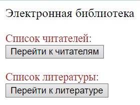
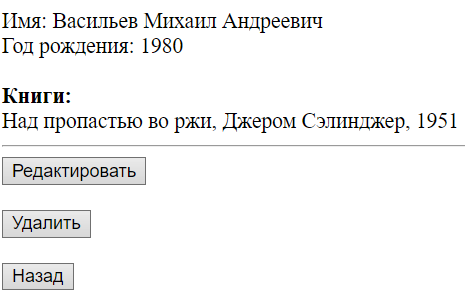

## Проект "Электронная библиотека"
### Описание:
Электронная библиотека представляет собой цифровой учёт книг.
Пользователь имеет возможность регистрировать читателей, добавлять книги,
выдавать книги читателям и освобождать их.
### Функционал:

0) Начальная страница

   
   
1) Страница добавления, изменения и удаления книги (аналогично с человеком).

   
   -
   

2) Страница со списком всех людей (люди кликабельные - при клике осуществляется
   переход на страницу человека).

   

3) Страница со списком всех книг (книги кликабельные - при клике осуществляется
   переход на страницу книги).

   

4) Если человек не взял ни одной книги, отображается текст текст "Человек
   пока не взял ни одной книги". Если книга назначена человеку, то у него отображаются назначенные книги.

   
   -
   

5) Если книга свободна, то отображается выпадающий список
   со всеми людьми и кнопка "Назначить книгу". Эта кнопка нажимается библиотекарем
   тогда, когда читатель хочет забрать эту книгу домой. После нажатия на эту кнопку, книга
   принадлежит выбранному человеку и появляется в его списке
   книг.

   
   -
   

6) Все поля валидируются с помощью @Valid и Spring Validator (сделана проверка на уникальность ФИО)
    
   
   -
   
### Сущности:
- Человек
- Книга

Связь: Один ко многим

   

### Реализовано с использованием Spring Framework:
- Spring Core
- Spring MVC
- JdbcTemplate
- Liquibase

База данных: PostreSQL
